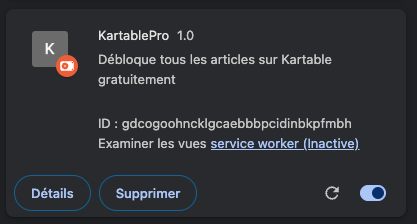
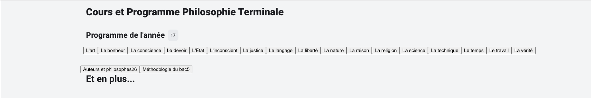
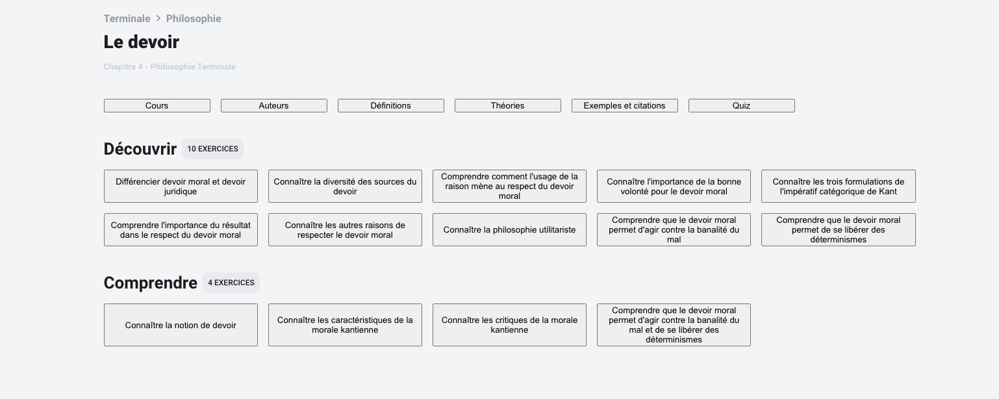

# Extension Chrome KartablePro

KartablePro est une extension Chrome qui débloque gratuitement tous les articles sur Annabac. Dites adieu aux barrières de paiement et accédez aux contenus Annabac sans aucune restriction.

## Installation

1. Téléchargez l'archive .zip de l'extension [ici](https://github.com/NohamR/KartablePro/releases/latest) et déziper la.

2. Allez sur [chrome://extensions/](chrome://extensions/).
Activez le mode "Développeur" dans le coin supérieur droit.
Cliquez sur "Charger l'extension non empaquetée" et sélectionnez le dossier de l'extension.

3. Rendez-vous sur [kartable.fr](https://www.kartable.fr/terminale/) et naviguer vers le sujet ou la fiche qui vous intéresse.

## Utilisation
Il est possible d'utiliser l'extension avec ou sans compte. L'usage d'un compte apporte plus de facilité pour la navigation entre les matières.

## Avertissement
Cette extension est destinée à des fins éducatives et informatives uniquement. Le développeur n'est pas responsable de tout usage abusif ou d'un accès non autorisé au contenu.